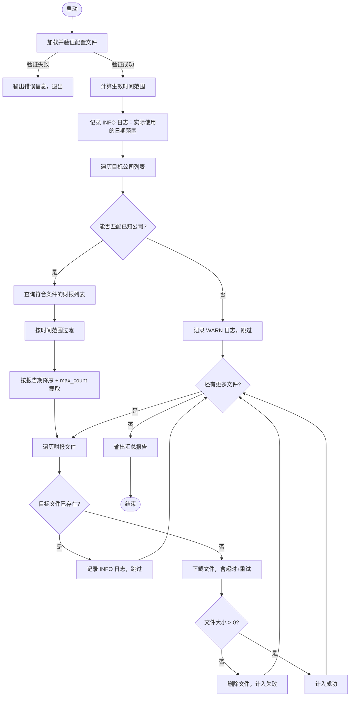

# Design Document — Financial Report Fetcher

## Overview

财报拉取工具（Financial Report Fetcher）是一个基于配置文件驱动的自动化命令行工具，使用 Python 3 实现。用户通过 YAML/JSON 配置文件指定目标公司、时间范围、财报类型和本地存储目录，工具自动从数据源获取对应的财务报告 PDF 文件并保存到本地。

### 核心目标

- **配置驱动**：所有行为由配置文件控制，无需修改代码
- **容错性强**：单个公司或文件失败不影响整体流程
- **幂等性**：重复执行不会覆盖已有文件
- **可观测性**：完整的结构化日志和汇总报告

### 系统边界

```
┌─────────────────────────────────────────────────────┐
│                Financial Report Fetcher              │
│                                                     │
│  ┌──────────┐   ┌──────────┐   ┌───────────────┐   │
│  │  Config  │──▶│ Fetcher  │──▶│  Downloader   │   │
│  └──────────┘   └──────────┘   └───────────────┘   │
│       │              │                  │           │
│  配置文件        数据源 API         本地文件系统      │
└─────────────────────────────────────────────────────┘
```

---

## Architecture

### 模块划分

系统采用三层职责分离架构：

```
financial_report_fetcher/
├── __main__.py          # 入口，CLI 参数解析
├── config.py            # Config 模块：配置加载与验证
├── fetcher.py           # Fetcher 模块：财报查询与过滤
├── downloader.py        # Downloader 模块：文件下载与管理
├── models.py            # 共享数据模型（dataclasses）
└── exceptions.py        # 自定义异常类型
```

### 执行流程



### 依赖关系

| 依赖 | 用途 | 版本约束 |
|------|------|----------|
| `pyyaml` | 配置文件解析 | `>=6.0` |
| `requests` | HTTP 下载 | `>=2.28` |
| `pydantic` | 配置模型验证 | `>=2.0` |
| `tenacity` | 重试策略 | `>=8.0` |

---

## Components and Interfaces

### Config 模块（`config.py`）

负责从文件系统读取配置文件，并通过 Pydantic 模型进行结构验证和语义校验。

```python
class ConfigLoader:
    def load(self, path: str) -> AppConfig:
        """
        加载并验证配置文件。
        
        :raises ConfigFileNotFoundError: 配置文件不存在，错误信息包含路径
        :raises ConfigParseError: 配置格式无效，错误信息包含字段名
        :raises ConfigValidationError: 配置语义错误（日期范围、max_count等），错误信息包含字段名
        """
```

**配置文件格式（YAML 示例）**：

```yaml
storage_dir: ./reports

companies:
  - ticker: "600519"
    name: "贵州茅台"
  - name: "比亚迪"

report_types:
  - annual
  - semi_annual

start_date: "2022"
end_date: "2023-12-31"

max_count: 10
```

### Fetcher 模块（`fetcher.py`）

负责根据过滤条件（公司、时间范围、财报类型、数量上限）查询并返回目标财报列表。

```python
class ReportFetcher:
    def fetch(self, config: AppConfig) -> Iterator[ReportMeta]:
        """
        根据配置拉取财报元信息列表。
        对无法匹配的公司记录 WARN 日志并跳过。
        返回过滤、排序、截取后的 ReportMeta 迭代器。
        """

    def _resolve_company(self, company: CompanyConfig) -> Optional[str]:
        """解析公司标识；优先使用 ticker，其次 name。"""

    def _apply_filters(
        self,
        reports: List[ReportMeta],
        date_range: DateRange,
        report_types: List[ReportType],
        max_count: Optional[int],
    ) -> List[ReportMeta]:
        """
        先按时间范围+类型过滤，再按报告期降序排序，最后截取 max_count 条。
        """
```

### Downloader 模块（`downloader.py`）

负责将财报文件下载到本地，处理目录创建、文件名生成、跳过逻辑、重试、验证和汇总报告。

```python
class ReportDownloader:
    TIMEOUT_SECONDS: int = 60
    MAX_RETRIES: int = 3
    RETRY_WAIT_SECONDS: int = 5

    def download_all(
        self, reports: Iterator[ReportMeta], storage_dir: str
    ) -> DownloadSummary:
        """
        下载所有财报，返回 DownloadSummary（成功/跳过/失败数量）。
        单个文件失败不中断整体流程。
        """

    def download_one(self, report: ReportMeta, storage_dir: str) -> DownloadStatus:
        """
        下载单个财报文件：
        - 若同名文件存在，返回 SKIPPED
        - 下载成功且文件非空，返回 SUCCESS
        - 下载失败或文件为空，返回 FAILED
        """

    @staticmethod
    def build_filename(report: ReportMeta) -> str:
        """
        生成文件名：{company_id}_{report_type}_{period}.pdf
        例如：600519_年报_2023.pdf
        """
```

---

## Data Models

所有模型定义在 `models.py` 中，使用 Python `dataclasses` 和 `pydantic`。

```python
from enum import Enum
from dataclasses import dataclass
from datetime import date
from typing import Optional, List
from pydantic import BaseModel, field_validator, model_validator

class ReportType(str, Enum):
    ANNUAL = "annual"
    SEMI_ANNUAL = "semi_annual"
    QUARTERLY = "quarterly"

class DownloadStatus(str, Enum):
    SUCCESS = "success"
    SKIPPED = "skipped"
    FAILED = "failed"

# --- Pydantic 配置模型 ---

class CompanyConfig(BaseModel):
    ticker: Optional[str] = None   # 股票代码，1~9 位数字或字母
    name: Optional[str] = None     # 公司名称

    @model_validator(mode="after")
    def at_least_one_identifier(self) -> "CompanyConfig":
        if not self.ticker and not self.name:
            raise ValueError("每个公司必须提供 ticker 或 name 其中之一")
        return self

class AppConfig(BaseModel):
    storage_dir: str
    companies: List[CompanyConfig]          # 1~50 家
    report_types: List[ReportType] = [ReportType.ANNUAL]
    start_date: Optional[date] = None
    end_date: Optional[date] = None
    max_count: Optional[int] = None         # 1~10000

    @field_validator("companies")
    @classmethod
    def validate_companies_count(cls, v: list) -> list:
        if not (1 <= len(v) <= 50):
            raise ValueError("companies 字段需包含 1 至 50 家公司")
        return v

    @field_validator("max_count")
    @classmethod
    def validate_max_count(cls, v: Optional[int]) -> Optional[int]:
        if v is not None and not (1 <= v <= 10000):
            raise ValueError("max_count 需为 1 至 10000 之间的正整数")
        return v

    @model_validator(mode="after")
    def validate_date_range(self) -> "AppConfig":
        has_start = self.start_date is not None
        has_end = self.end_date is not None
        if has_start ^ has_end:
            missing = "end_date" if has_start else "start_date"
            raise ValueError(f"start_date 和 end_date 必须同时指定，缺少字段: {missing}")
        if has_start and has_end and self.start_date > self.end_date:
            raise ValueError(
                f"start_date ({self.start_date}) 不能晚于 end_date ({self.end_date})"
            )
        return self

# --- 运行时数据模型 ---

@dataclass
class DateRange:
    start: date
    end: date

    def contains(self, d: date) -> bool:
        return self.start <= d <= self.end

@dataclass
class ReportMeta:
    company_id: str          # 优先使用 ticker，其次 name
    report_type: ReportType
    period: date             # 报告期（通常为年末/半年末日期）
    download_url: str
    title: str               # 财报标题

@dataclass
class DownloadSummary:
    success: int = 0
    skipped: int = 0
    failed: int = 0

    @property
    def total(self) -> int:
        return self.success + self.skipped + self.failed
```

### 日期解析规则

| 输入格式 | 解析为 start_date | 解析为 end_date |
|----------|-----------------|----------------|
| `"2023"` | `2023-01-01` | `2023-12-31` |
| `"2023-06-30"` | `2023-06-30` | `2023-06-30` |

### 默认值规则

| 配置项 | 未配置时的默认行为 |
|--------|-----------------|
| `start_date` / `end_date` | 自动设为运行时上一自然年度（`{year-1}-01-01` 至 `{year-1}-12-31`） |
| `max_count` | 每家公司默认最多 1 份 |
| `report_types` | 默认 `["annual"]` |

---

## Correctness Properties

*属性（Property）是指在系统所有合法执行中都应成立的行为特征——它是人类可读的规范与机器可验证的正确性保证之间的桥梁。*

以下属性基于接受标准分析推导而来，用于指导属性化测试（Property-Based Testing）的编写。

---

### Property 1: Fetcher 仅返回目标公司的财报

*对任意* 目标公司集合 C 和任意候选财报集合 R，Fetcher 的过滤结果中，每一条财报的公司标识都必须属于集合 C，结果中不出现非目标公司的财报。

**Validates: Requirements 1.2**

---

### Property 2: 未知公司标识被跳过且日志包含原始标识

*对任意* 无法匹配到已知公司的标识 id，Fetcher 在处理后：（1）警告日志中包含字符串 id；（2）最终下载结果中不包含该标识对应的财报。

**Validates: Requirements 1.5**

---

### Property 3: 配置错误信息包含相关字段名或路径

*对任意* 导致配置加载失败的输入（文件不存在、格式错误、字段非法），返回的错误信息字符串中必须包含：路径（文件不存在时）或相关字段名（格式/语义错误时）。

**Validates: Requirements 1.3, 1.4, 3.5, 3.6, 3.7**

---

### Property 4: 文件命名格式不变式

*对任意* 合法的公司标识 company_id、财报类型 report_type、报告期 period，`Downloader.build_filename()` 生成的文件名必须满足正则 `^.+_.+_.+\.pdf$`，且三个字段之间以下划线分隔，后缀为 `.pdf`。

**Validates: Requirements 2.2**

---

### Property 5: 已存在文件不被覆盖

*对任意* 目标路径下已存在的文件，调用 `download_one()` 后：（1）返回状态为 SKIPPED；（2）文件内容与原内容完全一致（未被修改）。

**Validates: Requirements 2.4**

---

### Property 6: 下载汇总计数完整性

*对任意* 一批 n 个财报的下载结果，`DownloadSummary` 满足：`success + skipped + failed == n`，三个字段均为非负整数。

**Validates: Requirements 2.5**

---

### Property 7: 单个失败不中断整体流程

*对任意* 包含 n 个财报的下载任务，其中任意 k 个（0 ≤ k ≤ n）失败，`download_all()` 的总处理数量（成功+跳过+失败）仍等于 n，不会提前退出。

**Validates: Requirements 2.6**

---

### Property 8: 重试次数不超过上限

*对任意* 持续失败的下载任务（mock 网络始终报错），`download_one()` 发起的实际 HTTP 请求次数不超过 4（1 次初始 + 最多 3 次重试）。

**Validates: Requirements 2.7**

---

### Property 9: 零字节文件被删除并计入失败

*对任意* 下载后大小为 0 字节的文件：（1）该文件在磁盘上被删除；（2）对应条目计入 `failed` 而非 `success`。

**Validates: Requirements 2.8**

---

### Property 10: 日期区间过滤闭区间性

*对任意* 日期区间 [start, end] 和任意财报集合，过滤后结果中每条财报的报告期 d 满足 `start <= d <= end`；区间外的财报不出现在结果中。

**Validates: Requirements 3.2**

---

### Property 11: max_count 截取顺序与数量约束

*对任意* 财报集合（经时间过滤后）和任意 max_count 值 k，截取结果满足：（1）结果数量 `<= k`；（2）结果按报告期降序排列；（3）若原集合数量 `>= k`，则结果数量恰好等于 k。

**Validates: Requirements 3.4**

---

### Property 12: 默认时间范围为运行时上一自然年度

*对任意* 运行时当前日期 today（通过 mock 注入），当 start_date 和 end_date 均未配置时，Fetcher 实际使用的时间范围为 `{today.year - 1}-01-01` 至 `{today.year - 1}-12-31`。

**Validates: Requirements 4.1**

---

### Property 13: report_types 过滤精确性

*对任意* report_types 配置子集 T（T ⊆ {annual, semi_annual, quarterly}，T 非空）和任意财报集合，过滤结果中每条财报的类型都属于 T，类型不在 T 中的财报不出现在结果中。

**Validates: Requirements 5.2**

---

### Property 14: 非法 report_types 返回包含非法值的错误信息

*对任意* 包含至少一个非法字符串的 report_types 列表，Config 验证应返回包含该非法值的错误信息，且不启动拉取流程。

**Validates: Requirements 5.4**

---

## Error Handling

### 异常层次

```python
class FetcherBaseError(Exception):
    """所有自定义异常的基类"""

class ConfigFileNotFoundError(FetcherBaseError):
    """配置文件不存在，消息中包含绝对路径"""

class ConfigParseError(FetcherBaseError):
    """YAML/JSON 解析失败，消息中包含出错字段名或行号"""

class ConfigValidationError(FetcherBaseError):
    """配置语义验证失败，消息中包含字段名和错误原因"""

class DownloadTimeoutError(FetcherBaseError):
    """单文件下载超时（60秒）"""

class DownloadError(FetcherBaseError):
    """下载失败（非超时），包含文件名和原始异常信息"""
```

### 错误处理策略

| 场景 | 处理方式 | 日志级别 |
|------|----------|----------|
| 配置文件不存在 | 抛出 `ConfigFileNotFoundError`，程序退出 | ERROR |
| 配置格式/语义错误 | 抛出 `ConfigValidationError`，程序退出 | ERROR |
| 公司标识无法匹配 | 跳过该公司，继续处理 | WARN |
| 单文件下载失败 | 记录错误，继续下载其他文件 | ERROR |
| 下载超时 | 触发重试，超过3次后计入失败 | WARN/ERROR |
| 文件大小为0 | 删除文件，计入失败 | ERROR |

### 日志格式

采用结构化日志，使用 Python 标准库 `logging`：

```
2024-01-15 10:30:00 INFO  [Fetcher] 默认时间范围已应用：start_date=2023-01-01, end_date=2023-12-31
2024-01-15 10:30:01 WARN  [Fetcher] 无法匹配公司标识 "UNKNOWN123"，已跳过
2024-01-15 10:30:05 INFO  [Downloader] 文件已存在，跳过：./reports/600519_年报_2023.pdf
2024-01-15 10:30:10 ERROR [Downloader] 文件下载失败：600519_季报_2023Q1.pdf | 原因: Connection timeout
```

---

## Testing Strategy

### 测试分层

本项目采用**单元测试 + 属性测试 + 集成测试**三层策略：

```
tests/
├── unit/
│   ├── test_config.py          # Config 模块单元测试
│   ├── test_fetcher.py         # Fetcher 过滤逻辑单元测试
│   └── test_downloader.py      # Downloader 单元测试（含 mock）
├── property/
│   └── test_properties.py      # 属性化测试（使用 Hypothesis）
└── integration/
    └── test_download_flow.py   # 端到端集成测试（使用临时目录）
```

### 属性化测试（Property-Based Testing）

使用 **[Hypothesis](https://hypothesis.readthedocs.io/)** 库（Python 主流 PBT 框架）。

每个属性测试使用 `@settings(max_examples=100)` 配置最少 100 次随机输入迭代。

每个测试通过注释标注其对应的设计属性：

```
# Feature: financial-report-fetcher, Property {n}: {属性描述}
```

**各属性对应测试概要：**

| 属性 | 测试方法 | Hypothesis 策略 |
|------|----------|----------------|
| P1：Fetcher 仅返回目标公司财报 | `test_fetcher_only_returns_target_companies` | `st.lists(st.text())` 公司集合 + 随机财报集合 |
| P3：错误信息包含字段名/路径 | `test_config_error_message_contains_field_name` | `st.fixed_dictionaries` 缺字段或非法值 |
| P4：文件命名格式不变式 | `test_filename_format_invariant` | `st.text()` 公司标识 + `st.sampled_from(ReportType)` |
| P5：已存在文件不被覆盖 | `test_existing_file_not_overwritten` | `st.binary()` 文件内容 |
| P6：下载汇总计数完整性 | `test_download_summary_counts_sum_to_total` | `st.lists(st.sampled_from(DownloadStatus))` |
| P7：单个失败不中断流程 | `test_single_failure_does_not_abort_flow` | `st.lists` 随机失败位置 |
| P8：重试次数不超过上限 | `test_retry_count_does_not_exceed_limit` | `st.integers` mock 失败次数 |
| P9：零字节文件被删除 | `test_zero_byte_file_deleted_and_counted_as_failure` | `st.just(b"")` |
| P10：日期区间过滤闭区间性 | `test_date_range_filter_is_closed_interval` | `st.dates()` 区间 + 随机报告期集合 |
| P11：max_count 截取约束 | `test_max_count_truncation_order_and_count` | `st.integers(1,10000)` + `st.lists(st.dates())` |
| P12：默认时间范围计算 | `test_default_date_range_is_previous_year` | `st.dates()` mock 当前时间 |
| P13：report_types 过滤精确性 | `test_report_type_filter_is_exact` | `st.frozensets(st.sampled_from(ReportType))` |
| P14：非法 report_types 报错 | `test_invalid_report_type_returns_error_with_value` | `st.text()` 随机非法字符串 |

### 单元测试（示例测试）

聚焦具体行为验证，不由属性测试覆盖的边界情况：

- 未配置 `max_count` 时默认值为 1（需求 4.3）
- 未配置 `report_types` 时默认为 `["annual"]`（需求 5.3）
- 未配置时间范围时 INFO 日志包含实际日期值（需求 4.4）
- `YYYY` 格式日期解析规则（需求 3.1）

### 集成测试

使用 `pytest` + `tmp_path` 夹具，测试完整下载流程：

- 目标目录不存在时自动创建（需求 2.3）
- 文件成功保存到指定目录（需求 2.1）
- 完整汇总报告输出（需求 2.5）

### 测试命令

```bash
# 运行所有测试（单次执行，不启动 watch 模式）
python3 -m pytest tests/ -v

# 仅运行属性测试
python3 -m pytest tests/property/ -v

# 仅运行单元测试
python3 -m pytest tests/unit/ -v
```
